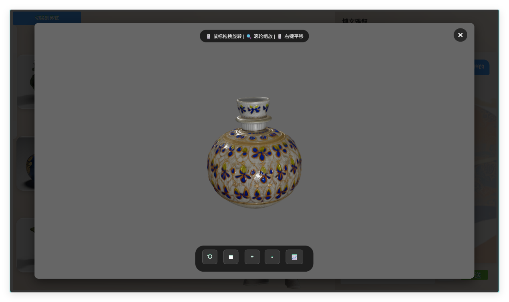
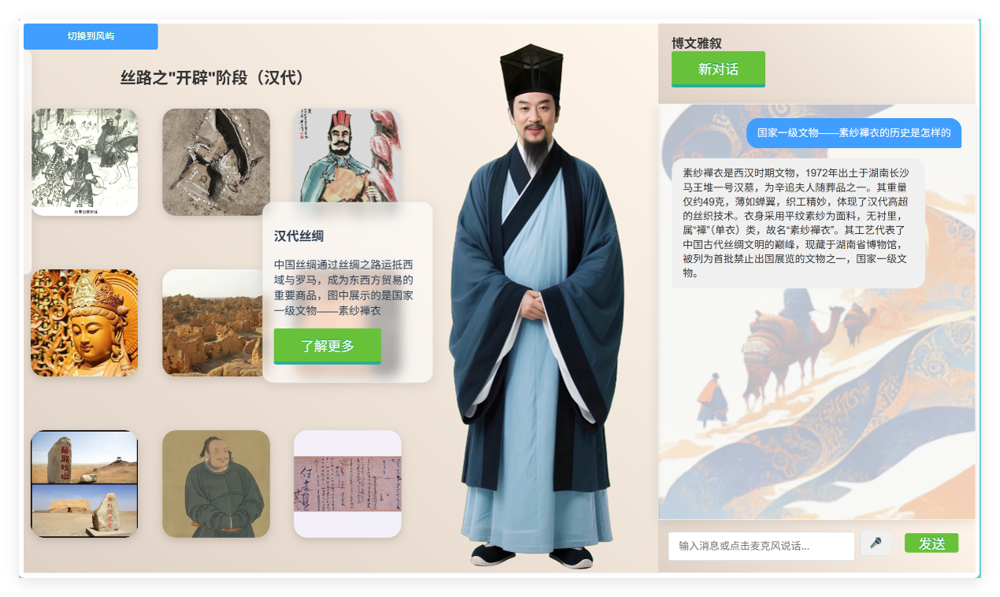
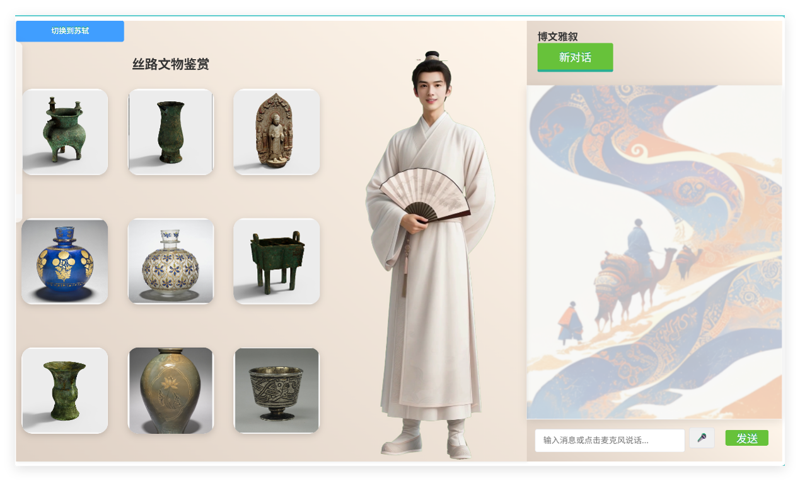
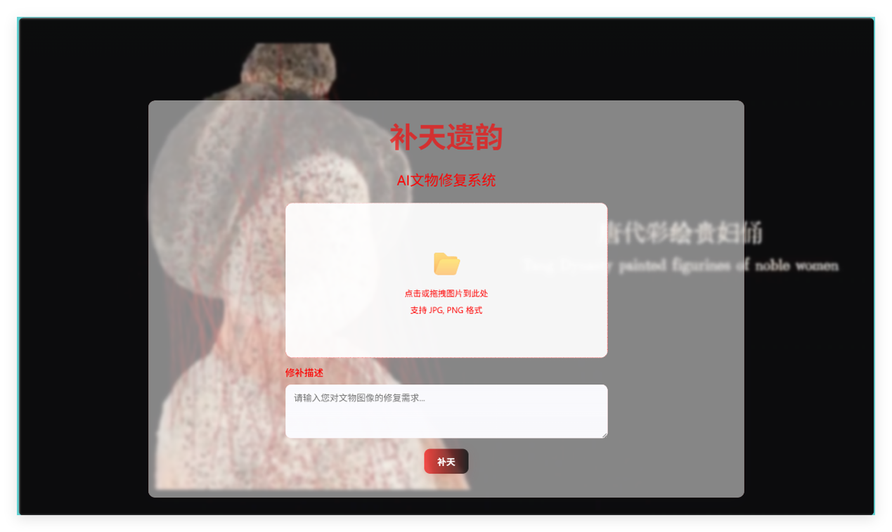
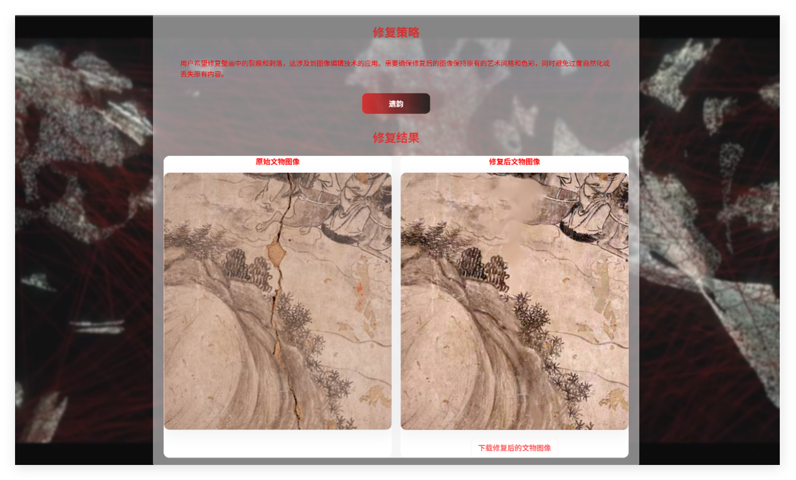
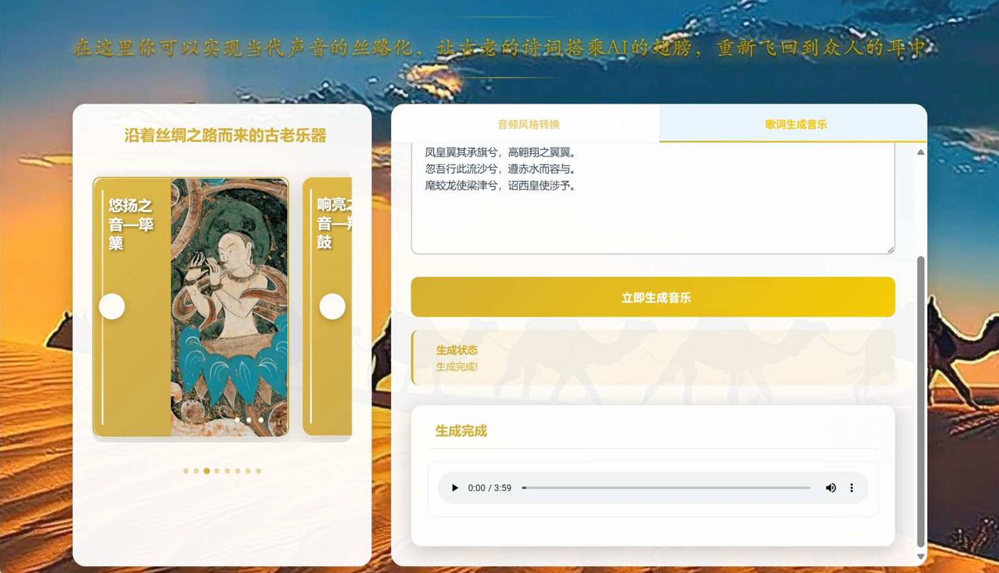
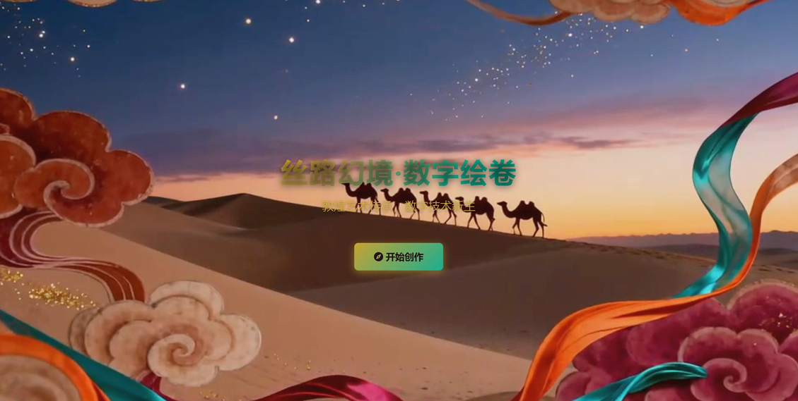
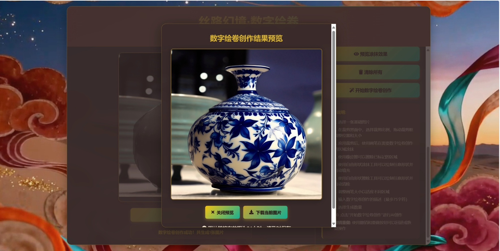
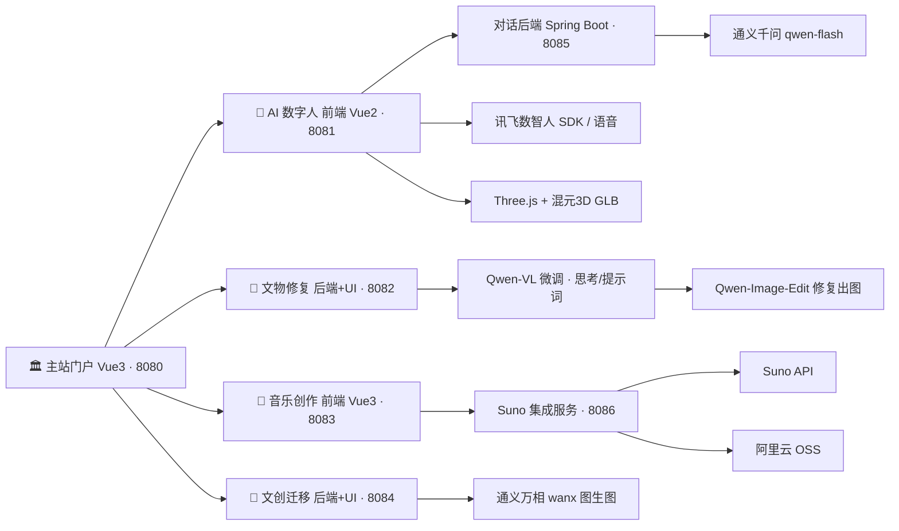

# 数字丝路 · silu

> 一条跨越千年的数字丝路 —— 用 AI 让文物"活"起来、让历史"说"出来。
> 面向"文化 × AI"的全栈实践项目，包含**丝路主题门户站**与**四大 AI 功能模块**：AI 数字人文博导览、AI 文物图像修复、AI 古风音乐创作、AI 文创风格迁移。

<p align="center">
  
</p>

---

## 📖 项目简介

**silu（数字丝路）** 是一个以丝绸之路文化传承为主题、将生成式 AI 能力落地到文博场景的全栈作品集项目。整个系统以一段"从长安出发、穿越敦煌、抵达未来"的沉浸式故事线为主站，串起四个可独立运行、开箱即体验的 AI 应用：

| 模块 | 一句话介绍 | 对应目录 | 默认端口 |
| --- | --- | --- | --- |
| 🏛️ **丝路·时空之旅（主站）** | 6 屏横滑沉浸式门户，串联全部功能 | `demo/` | 8080 |
| 👤 **AI 数字人文博导览** | 与苏轼/风屿数字人实时对话，边讲文物边看 3D 模型 | `project1/` | 前端 8081 / 对话后端 8085 |
| 🔧 **AI 文物图像修复** | 上传破损文物照片，自动生成修复提示词并出图 | `project2/` | 8082 |
| 🎵 **AI 古风音乐创作** | 按歌词一键生成国风歌曲，或把任意音频"古风化" | `project3/` | 前端 8083 / 服务 8086 |
| 🎨 **AI 文创风格迁移** | 涂抹式局部编辑，把文物纹样变成文创设计 | `project4/` | 8084 |

> 各模块独立成档：后端统一 **Spring Boot 3.x + Java 17**；前端 **Vue 2 / Vue 3**；AI 能力基于 **阿里云百炼 DashScope（通义千问 / 通义万相）**，并接入 **讯飞数智人 SDK、Suno 音乐生成 API、混元 3D** 等第三方能力。

---

## ✨ 功能演示

### 1. 👤 AI 数字人文博导览（`project1/`）

以"丝路藏经洞：与 AI 数字人对话千年丝路"为场景，提供两位可对话的数智人形象（苏轼 / 风屿），按「开辟 → 鼎盛 → 转折 → 沉淀 → 新生 → 文物」六个篇章讲述丝路故事；观众提问时，数字人不仅回答，还能在右侧调出对应文物的 **3D 模型**供全方位把玩。3D 文物模型由 **腾讯混元 3D 3.0** 生成，通过 Three.js 在浏览器中渲染交互。

<p align="center">
  
  
  
  
</p>

**技术链路**

```
用户语音/文字 → 讯飞数智人 avatar-sdk-web（口型/表情/肢体渲染）
             → Spring Boot 对话后端（维护多轮上下文）
             → 通义千问 qwen-flash（精通中华文化的讲解大脑）
文物 3D 查看  → Three.js + GLTFLoader（加载混元3D生成的 GLB 模型）
```

### 2. 🔧 AI 文物图像修复（`project2/`）

"补天遗韵"文物图像修复台：上传破损/残缺的壁画、器物照片并描述修复意图，系统先用**微调后的多模态模型理解画面**（自动拆解为「思考 / 正向提示词 / 负向提示词」），再交由 **Qwen-Image-Edit 图像编辑模型**完成修复生成，兼顾清晰度与文物原真性。

<p align="center">
  
  
</p>

**双模型 Prompt 自动工程 Pipeline**

```
破损文物图片 + 修复需求
   → Qwen-VL(微调) 理解图像并输出【思考 / 正向提示词 / 负向提示词】
   → QwenVLOutputParser 结构化解析（正则 + 容错兜底）
   → qwen-image-edit 按提示词生成修复结果
```

- 微调模型：**Qwen2.5-VL-3B-Instruct**（SFT，约 670 张文物图像数据集）
- 训练工程：LoRA / FlashAttention-2 / DeepSpeed ZeRO-3 / bf16 / 梯度检查点，支持视觉、融合层、语言模块分层微调控制

### 3. 🎵 AI 古风音乐创作（`project3/`）

"丝路乐坊"音乐创作台，提供两种玩法：

- **歌词生成音乐**：输入歌词、选择国风乐器风格（古琴 / 古筝 / 箫 / 笛子…），异步任务生成歌曲；
- **音频风格转换**：上传现有 MP3/WAV，一键转成古筝、琵琶、二胡等古风版本。

<p align="center">
  
</p>

**技术链路**

```
Vue3 前端(8083)
  → Suno 集成后端(8086)：歌词/参数组装、任务异步轮询、回调通知
  → 第三方 Suno API 生成
  → 成品音频回传 + 阿里云 OSS 存储 / 本地静态服务
```

### 4. 🎨 AI 文创风格迁移（`project4/`）

"AI 文创风格迁移系统"：上传基底图 + 蒙版（涂出想要编辑的区域），系统基于 **通义万相 wanx 图生图（image-synthesis）** 在指定区域做风格化/重绘——例如把一件青铜器纹样迁移到帆布袋、把敦煌色敷到 T 恤上，实时产出文创设计稿。

<p align="center">
  
  
</p>

**实现要点**：上传文件 → 校验格式/分辨率 → 蒙版预处理（黑底白描区）→ 上传 DashScope OSS → 提交图像合成异步任务 → 轮询获取结果图 URL。

---

## 🧭 主站：丝路 · 时空之旅（`demo/`）

横向滚屏的沉浸式 Web 体验页，以数智人"丝路"为向导讲述完整故事线，作为四个 AI 功能的统一入口：

**首页（启程）→ 长安（商贸往来）→ 敦煌（壁画与修复）→ 音乐枢纽（丝路之声）→ 未来驿站（文化新生）→ 功能模块中心（四大 AI 体验入口）**

- 视频背景 + 全屏滚动切换（滚轮 / 键盘 / 导航栏均可翻页）
- 页面间共享背景音乐控制（animejs 动效）
- 每个模块由独立 Vue 组件承载，便于继续扩展新站点

---

## 🏗️ 技术架构总览

| 层 | 技术 |
| --- | --- |
| 前端 | Vue 2 / Vue 3 · Vue Router · Element UI · Axios · animejs |
| 3D | Three.js · GLTFLoader · OrbitControls（GLB 文物模型浏览器渲染） |
| 后端 | Spring Boot 3.x · Spring MVC · RestTemplate · Apache HttpClient · Java 17 · Maven |
| 大模型 | 通义千问 qwen-flash（对话）· Qwen-VL / Qwen-Image-Edit（多模态理解与图像修复）· Qwen2.5-VL LoRA 微调 · 通义万相 wanx（图像合成/风格迁移） |
| 第三方 | 讯飞数智人 avatar-sdk-web + 讯飞语音听写 · Suno 音乐生成 API · 混元 3D · 阿里云 OSS |
| 训练工程 | PyTorch · LoRA · FlashAttention-2 · DeepSpeed ZeRO-3 · bf16 |



---

## 🚀 快速开始

### 环境准备

- JDK 17+、Node 16+（Maven 可使用各模块自带 `mvnw`）
- 阿里云百炼 **DashScope API Key**（环境变量 `DASHSCOPE_API_KEY`）：对话 / 图像类模块必需
- 讯飞数智人账号凭证（数字人模块）、Suno API Key 与阿里云 OSS 凭证（音乐模块）

> 所有第三方密钥**统一通过环境变量或本地配置注入**

### 各模块运行

| 模块 | 启动命令 | 访问地址 |
| --- | --- | --- |
| 主站门户 | `cd demo && npm install && npm run serve` | http://localhost:8080 |
| 数字人对话后端 | `cd project1/demo && mvnw spring-boot:run -Dspring-boot.run.arguments=--server.port=8085` | http://localhost:8085 |
| 数字人前端 | `cd project1/web-sdk-vue2-master && npm install && npm run serve` | http://localhost:8081 |
| 文物修复 | `cd project2/demo && mvnw spring-boot:run` | http://localhost:8082/image-edit.html |
| 音乐前端 | `cd project3/suno-fronted && npm install && npm run serve` | http://localhost:8083 |
| 音乐集成服务 | `cd project3/suno-integration && mvnw spring-boot:run` | http://localhost:8086 |
| 文创风格迁移 | `cd project4/demo && mvnw spring-boot:run` | http://localhost:8084 |

> Windows 下使用 `mvnw.cmd`。详见各模块 README 与代码内配置注释。

---

## 📁 项目结构（精简）

```
silu
├── demo/                          # 丝路·时空之旅 主站门户（Vue3）
│   └── src/components/            # 首页/长安/敦煌/音乐/未来/功能中心 页面组件
├── project1/                      # AI 数字人文博导览
│   ├── demo/                      #   └ Spring Boot 对话后端（qwen-flash）
│   └── web-sdk-vue2-master/       #   └ Vue2 前端（讯飞数智人 + Three.js 3D 文物）
│       ├── src/vm-sdk/            #     数字人 / 语音 SDK 资源
│       ├── public/card6/glb/      #     混元3D GLB 模型（大文件未入库，可邮件索取）
│       └── src/assets/card6/      #     文物 2D 图卡
├── project2/demo/                 # AI 文物图像修复（补天遗韵）
│   └── src/main/java/.../aimuseum/# QwenVL / QwenImageEdit / QwenVLOutputParser
├── project3/                      # AI 古风音乐创作
│   ├── suno-fronted/              #   └ Vue3 前端
│   └── suno-integration/          #   └ Spring Boot Suno 集成 + OSS
├── project4/demo/                 # AI 文创风格迁移
│   └── src/main/resources/static/ #   单页前端（Vue3 CDN）与后端同源部署
├── 项目截图/                      # 各功能演示截图（README 配图来源）
│   ├── 功能1/                     #   数字人 + 混元3D
│   ├── 功能2/                     #   文物图像修复
│   ├── 功能3/                     #   歌曲生成
│   └── 功能4/                     #   文创编辑 / 生成
└── docs/                          # 技术解析文档（qwen-vl 微调 / 数字人 / 文物修复）
```

---

## 🧠 项目亮点

- **一个主题、四大 AI 落地场景**：对话讲解、图像修复、音乐创作、图像编辑被统一装进"丝路"文化叙事中，形成可演示、可讲述的完整体验闭环。
- **双模型 Prompt 自动工程（文物修复）**：用"会思考"的多模态模型代替人工撰写图像编辑提示词，配合解析器把「思考 / 正向 / 负向提示词」结构化，直接驱动编辑模型出图。
- **真实的多模态模型微调实践**：基于 Qwen2.5-VL-3B-Instruct 完成 LoRA + SFT 训练（约 670 张自建文物图像数据集），工程化处理 FlashAttention-2、DeepSpeed、分层学习率、断点续训等细节。
- **数字人 × 3D 文物联动讲解**：讯飞数智人负责"讲"，Three.js 负责"看"，并引入混元 3D 生成的文物模型，显著降低 3D 内容采集成本。
- **异步任务 + 对象存储（音乐）**：第三方生成任务按"提交 → 轮询 → 回调"接入，产物统一回传 OSS / 本地静态目录，前端专注交互与播放。
- **涂抹式局部图像编辑（文创）**：基于蒙版 + 万相 image2image 实现"圈哪里改哪里"，兼顾区域可控与风格一致。

---

## ⚠️ 运行前必读

- **密钥已脱敏**：所有真实密钥（DashScope / Suno / 阿里云 OSS / 讯飞开放平台）均已替换为环境变量注入或留空占位，仓库内不包含任何明文密钥；运行前请按「快速开始」一节配置自己的平台凭证；
- **大体积媒体资源不入库**：文物 GLB 3D 模型（单个 60–90 MB）、背景视频 / 音频等媒体文件未包含在本仓库中；运行对应模块前需将资源放回原目录，完整资源包可邮件联系作者获取：**sun_kan04@qq.com**；
- 建议忽略 `node_modules/`、`target/`、`dist/`、`*.log`、`uploads/*.mp3` 等生成物（根目录 `.gitignore` 已配置）。

---

## 📮 联系与资源获取

- 如需**完整媒体资源包**（文物 GLB 3D 模型、背景视频 / 音频素材等），或对项目有任何疑问与合作意向，欢迎邮件联系：**sun_kan04@qq.com**

---

## 📚 致谢与参考

- [阿里云百炼 DashScope · 通义千问 / 通义万相](https://help.aliyun.com/zh/model-studio/)
- Qwen-Image / Qwen2.5-VL 技术报告（含 [arXiv:2508.02324](https://arxiv.org/pdf/2508.02324)）
- 腾讯混元 3D（P3-SAM：点提示部件分割的 3D 生成模型）
- 讯飞开放平台（数智人 avatar-sdk / 语音听写）
- Suno 音乐生成 API · Three.js · Vue

---

*本项目为个人项目经历展示；项目内文物图片与 3D 素材仅用于学习与研究用途。*
